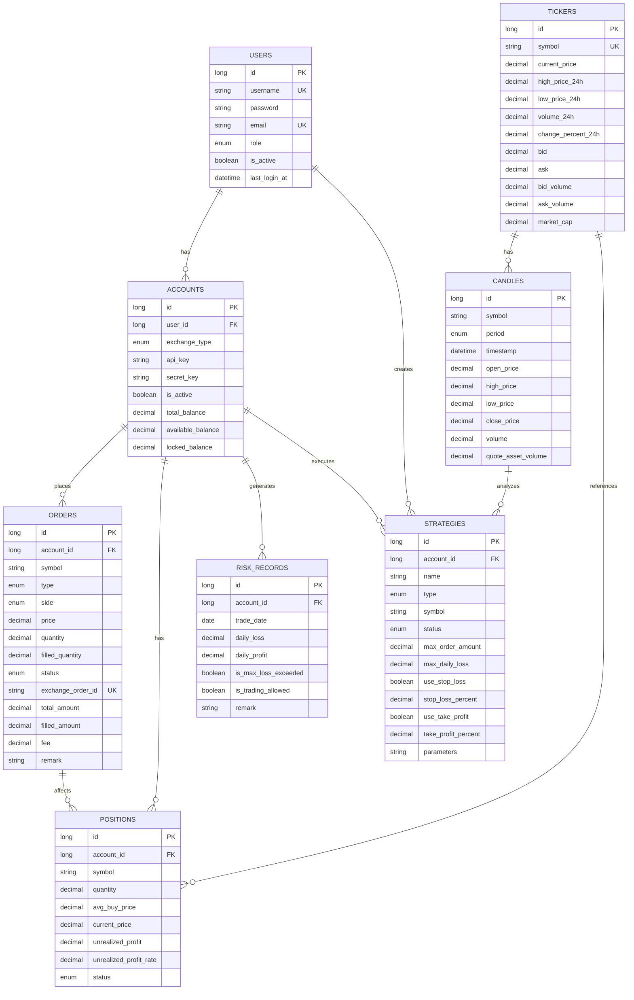

# 암호화폐 거래 봇 - 엔티티 관계도 (ERD)

## 📊 전체 ERD (Mermaid)



## 📋 엔티티 상세 정보

### 1. **USERS** (사용자)
| 필드 | 타입 | 설명 |
|------|------|------|
| id | Long | Primary Key |
| username | String | 사용자명 (Unique) |
| password | String | 비밀번호 |
| email | String | 이메일 (Unique) |
| role | Enum | ADMIN, USER |
| is_active | Boolean | 활성 여부 |
| last_login_at | DateTime | 마지막 로그인 시간 |
| created_at | DateTime | 생성 시간 (BaseEntity) |
| updated_at | DateTime | 수정 시간 (BaseEntity) |

---

### 2. **ACCOUNTS** (거래소 계정)
| 필드 | 타입 | 설명 |
|------|------|------|
| id | Long | Primary Key |
| user_id | Long | Foreign Key → USERS |
| exchange_type | Enum | UPBIT, BITHUMB |
| api_key | String | 거래소 API Key |
| secret_key | String | 거래소 Secret Key |
| is_active | Boolean | 활성 여부 |
| total_balance | Decimal | 총 잔액 |
| available_balance | Decimal | 사용 가능 잔액 |
| locked_balance | Decimal | 잠긴 잔액 |
| created_at | DateTime | 생성 시간 (BaseEntity) |
| updated_at | DateTime | 수정 시간 (BaseEntity) |

**Unique Constraint**: (user_id, exchange_type) - 사용자당 거래소별 1개 계정만

---

### 3. **ORDERS** (주문)
| 필드 | 타입 | 설명 |
|------|------|------|
| id | Long | Primary Key |
| account_id | Long | Foreign Key → ACCOUNTS |
| symbol | String | 암호화폐 심볼 (BTC, ETH 등) |
| type | Enum | LIMIT, MARKET |
| side | Enum | BUY, SELL |
| price | Decimal | 주문 가격 |
| quantity | Decimal | 주문 수량 |
| filled_quantity | Decimal | 체결된 수량 |
| status | Enum | PENDING, PARTIALLY_FILLED, FILLED, CANCELLED, REJECTED |
| exchange_order_id | String | 거래소 주문 ID (Unique) |
| total_amount | Decimal | 주문 총액 |
| filled_amount | Decimal | 체결된 총액 |
| fee | Decimal | 수수료 |
| remark | String | 비고 |
| created_at | DateTime | 생성 시간 (BaseEntity) |
| updated_at | DateTime | 수정 시간 (BaseEntity) |

**Index**: account_id, symbol, status

---

### 4. **POSITIONS** (포지션)
| 필드 | 타입 | 설명 |
|------|------|------|
| id | Long | Primary Key |
| account_id | Long | Foreign Key → ACCOUNTS |
| symbol | String | 암호화폐 심볼 |
| quantity | Decimal | 보유 수량 |
| avg_buy_price | Decimal | 평균 매수가 |
| current_price | Decimal | 현재 가격 |
| unrealized_profit | Decimal | 미실현 손익 |
| unrealized_profit_rate | Decimal | 미실현 손익률 |
| status | Enum | OPEN, CLOSED, PARTIAL |
| created_at | DateTime | 생성 시간 (BaseEntity) |
| updated_at | DateTime | 수정 시간 (BaseEntity) |

---

### 5. **TICKERS** (시세 정보)
| 필드 | 타입 | 설명 |
|------|------|------|
| id | Long | Primary Key |
| symbol | String | 암호화폐 심볼 (Unique) |
| current_price | Decimal | 현재 가격 |
| high_price_24h | Decimal | 24시간 고가 |
| low_price_24h | Decimal | 24시간 저가 |
| volume_24h | Decimal | 24시간 거래량 |
| change_percent_24h | Decimal | 24시간 변화율 |
| bid | Decimal | 매수가 |
| ask | Decimal | 매도가 |
| bid_volume | Decimal | 매수 거래량 |
| ask_volume | Decimal | 매도 거래량 |
| market_cap | Decimal | 시가총액 |
| created_at | DateTime | 생성 시간 (BaseEntity) |
| updated_at | DateTime | 수정 시간 (BaseEntity) |

---

### 6. **CANDLES** (캔들 데이터)
| 필드 | 타입 | 설명 |
|------|------|------|
| id | Long | Primary Key |
| symbol | String | 암호화폐 심볼 |
| period | Enum | ONE_MIN, FIVE_MIN, FIFTEEN_MIN, THIRTY_MIN, ONE_HOUR, FOUR_HOUR, ONE_DAY, ONE_WEEK |
| timestamp | DateTime | 캔들 시간 |
| open_price | Decimal | 시가 |
| high_price | Decimal | 고가 |
| low_price | Decimal | 저가 |
| close_price | Decimal | 종가 |
| volume | Decimal | 거래량 |
| quote_asset_volume | Decimal | 거래대금 |
| created_at | DateTime | 생성 시간 (BaseEntity) |
| updated_at | DateTime | 수정 시간 (BaseEntity) |

**Index**: (symbol, period), timestamp

---

### 7. **RISK_RECORDS** (위험 기록)
| 필드 | 타입 | 설명 |
|------|------|------|
| id | Long | Primary Key |
| account_id | Long | Foreign Key → ACCOUNTS |
| trade_date | Date | 거래 날짜 |
| daily_loss | Decimal | 일일 손실 |
| daily_profit | Decimal | 일일 수익 |
| is_max_loss_exceeded | Boolean | 최대 손실 초과 여부 |
| is_trading_allowed | Boolean | 거래 허용 여부 |
| remark | String | 비고 |
| created_at | DateTime | 생성 시간 (BaseEntity) |
| updated_at | DateTime | 수정 시간 (BaseEntity) |

---

### 8. **STRATEGIES** (거래 전략)
| 필드 | 타입 | 설명 |
|------|------|------|
| id | Long | Primary Key |
| account_id | Long | Foreign Key → ACCOUNTS |
| name | String | 전략명 |
| type | Enum | MOVING_AVERAGE, RSI, VOLUME_BASED, MEAN_REVERSION, AI_BASED |
| symbol | String | 적용 암호화폐 |
| status | Enum | ACTIVE, INACTIVE, PAUSED |
| max_order_amount | Decimal | 최대 주문 금액 |
| max_daily_loss | Decimal | 최대 일일 손실 |
| use_stop_loss | Boolean | 손절 사용 여부 |
| stop_loss_percent | Decimal | 손절 퍼센트 |
| use_take_profit | Boolean | 익절 사용 여부 |
| take_profit_percent | Decimal | 익절 퍼센트 |
| parameters | String | 전략 파라미터 (JSON) |
| created_at | DateTime | 생성 시간 (BaseEntity) |
| updated_at | DateTime | 수정 시간 (BaseEntity) |

---

## 🔗 관계 분석

### 1대 다(One-to-Many) 관계
- **USERS → ACCOUNTS**: 사용자는 여러 거래소 계정 보유 가능
- **ACCOUNTS → ORDERS**: 계정은 여러 주문 생성 가능
- **ACCOUNTS → POSITIONS**: 계정은 여러 포지션 보유 가능
- **ACCOUNTS → RISK_RECORDS**: 계정은 여러 위험 기록 생성
- **ACCOUNTS → STRATEGIES**: 계정은 여러 거래 전략 설정 가능
- **TICKERS → CANDLES**: 심볼별 여러 캔들 데이터 존재

### 다대 다(Many-to-Many) 관계
- **CANDLES ← STRATEGIES**: 전략이 여러 캔들 데이터 분석
- **ORDERS ← POSITIONS**: 주문이 포지션 변경

---

## 📈 데이터 흐름

```
사용자 생성
    ↓
거래소 계정 연동 (ACCOUNTS)
    ↓
거래 전략 설정 (STRATEGIES)
    ↓
시세 데이터 수신 (TICKERS, CANDLES)
    ↓
주문 생성 (ORDERS)
    ↓
포지션 관리 (POSITIONS)
    ↓
위험 관리 (RISK_RECORDS)
    ↓
수익/손실 계산
```

---

## 🔐 핵심 설계 원칙

1. **BaseEntity 상속**: 모든 엔티티가 BaseEntity를 상속하여 created_at, updated_at 자동 관리
2. **LazyLoading**: 성능 최적화를 위해 관계는 모두 LAZY로 설정
3. **Unique Constraint**: 중복 데이터 방지
   - (user_id, exchange_type): 사용자당 거래소별 1개 계정
   - symbol in TICKERS: 중복 심볼 방지
4. **Index**: 조회 성능 최적화
   - account_id, symbol, status in ORDERS
   - (symbol, period), timestamp in CANDLES
5. **Decimal 사용**: 금융 데이터의 정확성 보장
6. **Enum 사용**: 타입 안정성 확보


